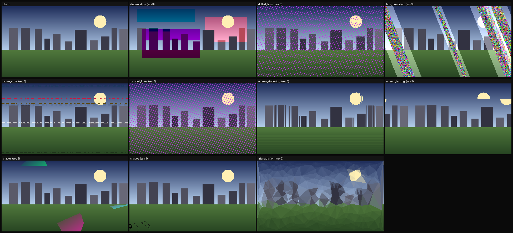

# GPU-CorruptNet

**An end-to-end computer-vision pipeline that detects and classifies GPU-rendered visual corruption** —
shader glitches, screen tearing, texture/block artifacts, discoloration, and stuck-memory
"morse-code" patterns — in rendered frames.

The project pairs a **supervised multi-label corruption classifier** (PyTorch) with an
**unsupervised anomaly head** for *unknown* corruption, trained on a self-built synthetic
corruption generator, and serves it behind a benchmarked inference API with **calibrated,
conformal confidence**.

> **Prior art / inspiration.** The 10 artifact classes follow the AMD/UCLA-RIPS *"Glitchify"*
> paper — *Automating Artifact Detection in Video Games* ([arXiv:2011.15103](https://arxiv.org/abs/2011.15103)) —
> which procedurally injects software-reproducible GPU artifacts because real corruption data is
> scarce. GPU-CorruptNet modernizes that 2020 classical-feature ensemble (84% seen / 69% unseen)
> with deep CNNs, an anomaly head for novel corruptions, and uncertainty quantification.

## The synthetic corruption generator ("Glitchify-2")

The crux of the project: real GPU-corruption datasets barely exist, so we *generate* labeled data
by procedurally injecting artifacts into clean frames. Below, one procedural frame corrupted by
each currently-implemented injector (`python scripts/make_sanity_grid.py`):



## Status

Actively building. Honest state — nothing here claims a metric it hasn't measured.

| Milestone | Scope | State |
|---|---|---|
| **M0** | Repo scaffold, config, tests, CI | ✅ done |
| **M1** | Glitchify-2 generator: 10 artifact classes ✅ · ImageNet-C wrapper ⬜ | 🚧 10/10 injectors done |
| **M2** | On-the-fly corruption dataset + seen/unseen *content* splits ✅ · Postgres/Mongo ⬜ | 🚧 pipeline done |
| **M3** | ResNet-50 / EfficientNet-B4 multi-label classifier + metrics | 🚧 code done, awaiting full run |
| **M4** | Unsupervised anomaly head (EfficientAD / PatchCore) | ⬜ |
| **M5** | Calibration (temperature scaling, ECE) + conformal sets (MAPIE) | ⬜ |
| **M6** | C++/libtorch inference path (+ optional HIP kernel) | ⬜ |
| **M7** | ONNX / FP16 export + latency-throughput benchmark harness | ⬜ |
| **M8** | AWS deploy (S3 + EC2-Spot) + FastAPI demo | ⬜ |
| **M9** | Drift / OOD monitor ("fixing deployed AI") | ⬜ |
| **M10** | Upload-a-frame dashboard demo | ⬜ |

**All 10 injectors implemented.** Pure NumPy: `screen_tearing`, `screen_stuttering`, `morse_code`,
`discoloration`, `parallel_lines`, `dotted_lines`. OpenCV batch (`pip install -e ".[cv]"`):
`shader`, `shapes`, `triangulation`, `line_pixelation`. The OpenCV set registers only when
OpenCV is present, so `available()` always reflects what's actually importable.

## Quickstart

```bash
python -m venv .venv && source .venv/bin/activate
pip install -e ".[dev]"

python scripts/make_sanity_grid.py     # -> assets/sanity_grid.png
pytest -q                              # generator unit tests
```

Apply a corruption programmatically:

```python
import numpy as np
from gpu_corruptnet.corruptions import apply, available
from gpu_corruptnet.data import make_demo_frame

frame = make_demo_frame()                      # or your own (H, W, 3) uint8 RGB frame
print(available())                             # implemented injectors
glitched = apply("screen_tearing", frame, severity=4, rng=0)
```

## Training the classifier (M3)

The classifier learns to predict *which* corruption(s) are present (multi-label) on clean
frames corrupted on-the-fly by Glitchify-2. Clean substrate is **STL-10**, with whole object
classes (ship/truck) held out as **unseen content** so the reported unseen-test macro-F1 is an
honest generalization number.

```bash
pip install -e ".[cv,train]"

python scripts/train_classifier.py --smoke                       # fast local sanity run
python scripts/train_classifier.py --arch resnet50 --epochs 10 --img-size 224
```

> First run downloads STL-10 (~2.6 GB, one-time cache). For the real run, use a free GPU:
> open [`notebooks/train_colab.ipynb`](notebooks/train_colab.ipynb) in Google Colab (Runtime →
> T4). Metrics for each run are written to `runs/metrics_*.json`.

## Design notes

- **Images** are `(H, W, 3)` `uint8` RGB throughout. **Severity** is `1..5`.
- Injectors **self-register** (`@register`) and never mutate their input; each is
  **deterministic given a seed** (enforced in tests) so every generated dataset is reproducible.
- The base install is intentionally light (NumPy/Pillow). Heavier deps arrive with the milestone
  that needs them — `[cv]`, `[train]`, `[common]` extras in `pyproject.toml`.

## Layout

```
src/gpu_corruptnet/
  corruptions/   # base types, registry, injectors (the Glitchify-2 generator)
  data/          # clean-frame sources (STL-10) + on-the-fly corruption dataset
  models/        # ResNet-50 / EfficientNet-B4 multi-label classifier
  utils/         # seeding / reproducibility
  metrics.py     # multi-label F1 / recall, derived binary corrupted-vs-clean
  train.py       # training loop + seen/unseen eval, writes runs/metrics_*.json
scripts/         # make_sanity_grid.py, train_classifier.py
notebooks/       # train_colab.ipynb (free-T4 run)
tests/           # generator unit tests
configs/         # default.yaml (seeds, frame size, class vocab)
```

## License

MIT
